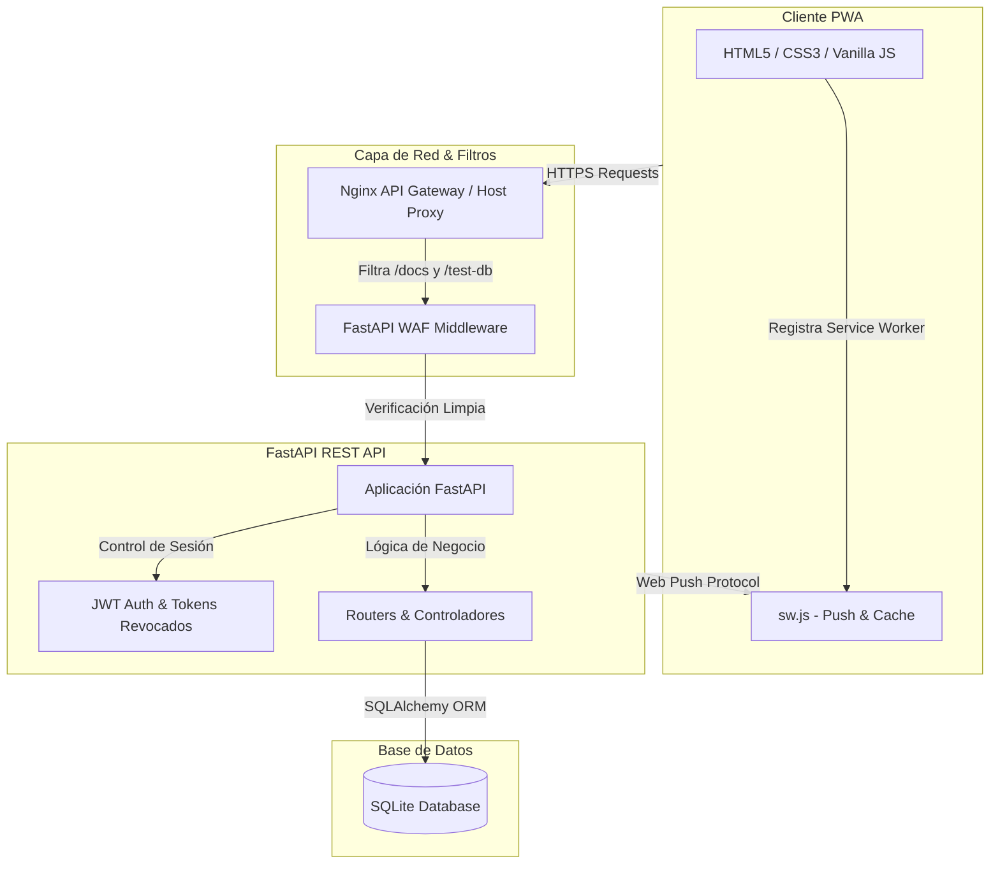

# 🚗 SCV - Sistema de Control Vehicular

<p align="center">
  
</p>

<p align="center">
  <a href="#"></a>
  <a href="#"></a>
  <a href="#"></a>
  <a href="#"></a>
  <a href="#"></a>
  <a href="#"></a>
</p>

---

## 📋 Descripción General

El **Sistema de Control Vehicular (SCV)** es una solución tecnológica integral a medida desarrollada para **Comercializadora Normetales S.A.S**. Está diseñada para optimizar y auditar en tiempo real la operación logística en el patio de carga y el ciclo de vida mecánico de la flota vehicular.

El sistema unifica tres pilares esenciales:
1. **Control de Despacho (Movimientos)**: Registro estricto de entradas y salidas de vehículos con datos clave como kilometraje, báscula, cantidad de sacas y observaciones del estado del cajón.
2. **Inspección de Seguridad (Chequeo Preoperacional)**: Listas de verificación digitales para evaluar si el vehículo cumple con las condiciones mecánicas y de seguridad para operar.
3. **Mantenimiento y Control de Hallazgos**: Flujo completo que captura anomalías (hallazgos), las evalúa, asigna órdenes de trabajo a mecánicos, registra costos y almacena evidencias fotográficas, todo auditado con trazabilidad inmutable.

---

## 🏗️ Arquitectura del Sistema

El proyecto cuenta con un diseño desacoplado que facilita la escalabilidad, el mantenimiento y una experiencia de usuario sumamente rápida en dispositivos móviles.



### Tecnologías Clave Utilizadas
* **Backend:** [FastAPI](https://fastapi.tiangolo.com/) (Python) para un rendimiento asíncrono excepcional, tipado estricto y generación de endpoints rápidos.
* **Frontend:** Single Page Application (SPA) nativa e instalable como PWA (Progressive Web App) con soporte offline básico y **Web Push Notifications** para alertas de turnos y mantenimientos. Sin frameworks pesados para garantizar tiempos de carga mínimos.
* **Base de Datos:** SQLite administrada a través de [SQLAlchemy ORM](https://www.sqlalchemy.org/), ideal para despliegues ligeros con alta velocidad de lectura.
* **Firewall de Aplicación (WAF):** Middleware integrado que escanea peticiones previniendo ataques comunes a nivel de código (SQLi, XSS, Path Traversal).

---

## 🗄️ Modelo de Datos y Entidades

El diseño relacional del sistema sigue la especificación **ER v2.0**, estructurada para mantener una auditoría estricta de cada cambio en la flota:

| Entidad | Campos Principales | Propósito / Relación |
| :--- | :--- | :--- |
| **`Usuario`** | `nombre`, `email`, `password_hash`, `rol` (admin, operario_movimientos, operario_chequeo, mecanico), `activo` | Gestiona el acceso y restringe los permisos según el rol del personal. |
| **`Vehiculo`** | `placa`, `marca`, `modelo`, `año`, `kilometraje`, `fecha_venc_soat`, `fecha_venc_rtm` | Registro y control de alertas de vencimientos de documentos legales de la flota. |
| **`Conductor`**| `nombre`, `cedula`, `licencia`, `fecha_venc_licencia`, `categoria` (C1, C2, C3) | Base de conductores autorizados con control de licencias. |
| **`Movimiento`**| `tipo` (salida/entrada), `kilometraje`, `bascula`, `sacas`, `cajon`, `observaciones` | Historial completo de operaciones en el patio de despacho. |
| **`Chequeo`** | `kilometraje`, `fecha_venc_soat/rtm/extintor`, `obs_generales` | Cabecera del chequeo preoperacional diario obligatorio. |
| **`ChequeoItem`**| `seccion` (luces, frenos, cabina, etc.), `item`, `valor` (conforme/no_conforme) | Detalle de la inspección. Los ítems *no conformes* generan alarmas mecánicas. |
| **`Hallazgo`** | `origen` (manual, chequeo, movimiento), `descripcion`, `criticidad`, `estado` | Reporte de fallas detectadas pendientes de evaluación administrativa. |
| **`OrdenTrabajo`**| `prioridad`, `estado`, `fecha_inicio`, `fecha_cierre`, `responsable_id` | Orden asignada para solucionar un hallazgo o realizar mantenimiento. |
| **`NuevaOrdenActividad`**| `titulo`, `descripcion`, `estado` (pendiente, en_progreso, completada) | Tareas y pasos específicos requeridos para cerrar una orden de trabajo. |
| **`NuevaOrdenCosto`**| `tipo_gasto` (repuesto, mano de obra, herramienta), `valor_unitario`, `total` | Registro de costos y facturación asociados a la reparación. |
| **`NuevaOrdenEvidencia`**| `ruta_archivo`, `tipo` (foto, documento, nota), `descripcion` | Soporte multimedia y documental del trabajo realizado. |
| **`OrdenHistorial`**| `accion`, `campo`, `valor_anterior`, `valor_nuevo`, `ip_usuario`, `user_agent` | **Auditoría inmutable**: Registro inalterable de todos los cambios de estado en las órdenes. |

---

## 🚀 Guía de Instalación y Ejecución (Local)

Sigue estos pasos para poner en marcha el entorno de desarrollo local:

### 1. Requisitos Previos
* Python 3.10 o superior.
* Node.js (opcional, solo para levantar el frontend rápidamente).

---

### 2. Configurar el Backend (FastAPI)

1. Ingresa a la carpeta del backend:
   ```bash
   cd scv-backend
   ```
2. Crea e instala el entorno virtual:
   ```bash
   python3 -m venv venv
   source venv/bin/activate  # En Windows: venv\Scripts\activate
   pip install -r requirements.txt
   ```
3. Crea tu archivo de configuración de entorno:
   ```bash
   cp .env.example .env
   ```
   > [!TIP]
   > Edita el archivo `.env` para ajustar variables como `SECRET_KEY`, `CORS_ALLOWED_ORIGINS` y activar o desactivar la base de datos de prueba.
4. Levanta el servidor de desarrollo asíncrono:
   ```bash
   uvicorn main:app --reload --host 0.0.0.0 --port 8000
   ```
5. Acceso al backend:
   * **API Base:** [http://localhost:8000](http://localhost:8000)
   * **Documentación Interactiva (Swagger):** [http://localhost:8000/docs](http://localhost:8000/docs) *(si `ENABLE_API_DOCS=True`)*

---

### 3. Importar Datos Iniciales (Opcional)
Si requieres sembrar datos de prueba o históricos de movimientos desde un archivo Excel:
1. Asegúrate de tener el archivo `.xlsx` en la ruta configurada en [importar_excel.py](file:///home/lunen/Proyectos/SCV/scv-backend/importar_excel.py).
2. Ejecuta el script de importación:
   ```bash
   python importar_excel.py
   ```

---

### 4. Configurar el Frontend (PWA)

El frontend está estructurado como una aplicación estática ligera.
1. Ve a la carpeta correspondiente:
   ```bash
   cd ../scv-frontend
   ```
2. Levanta un servidor estático web simple:
   * **Con Python:**
     ```bash
     python3 -m http.server 8080
     ```
   * **Con Node.js (Serve):**
     ```bash
     npx serve .
     ```
3. Abre tu navegador web en [http://localhost:8080](http://localhost:8080) (o el puerto indicado).

---

## 🐳 Despliegue en Producción (Docker + Gateway VPS)

Para el entorno de producción en un Servidor Privado Virtual (VPS), el sistema utiliza una arquitectura modular protegida tras una **API Gateway centralizada** en Docker. Esto permite correr múltiples microservicios aislados en el servidor, comunicándose internamente en una red privada y exponiendo únicamente los puertos 80 y 443 al exterior.

### Estructura de Redes Docker
* **`vps-gateway`**: Red externa encargada de conectar Nginx con las aplicaciones.
* **`scv-network`**: Red interna para la comunicación directa de `scv-frontend` y `scv-backend`.

### Pasos para Desplegar

1. **Crear la red común en Docker** (solo la primera vez):
   ```bash
   docker network create vps-gateway
   ```

2. **Iniciar la Gateway del VPS**:
   ```bash
   docker compose -f docker-compose.gateway.vps.yml up -d
   ```
   *Esto iniciará el contenedor `vps-gateway` basado en Nginx con los mapeos de volúmenes para certificados SSL.*

3. **Iniciar la Aplicación SCV**:
   ```bash
   # Asegurar variables de entorno antes del build
   cp scv-backend/.env.example scv-backend/.env
   
   # Construir e iniciar contenedores de frontend y backend
   docker compose -f docker-compose.app.yml up -d --build
   ```

4. **Configurar Dominio y HTTPS**:
   * Los archivos de configuración de host Nginx residen en [infra/gateway/conf.d/](file:///home/lunen/Proyectos/SCV/infra/gateway/conf.d).
   * Al habilitar tu certificado SSL, utiliza la plantilla SSL de ejemplo en `scv.normetales.xyz.ssl.conf.example`.
   * Recarga la configuración del servidor web dentro del contenedor:
     ```bash
     docker exec vps-gateway nginx -t
     docker exec vps-gateway nginx -s reload
     ```

---

## 🔒 Seguridad y Buenas Prácticas

> [!IMPORTANT]
> El sistema implementa las siguientes directrices de seguridad para proteger los datos operativos de **Comercializadora Normetales S.A.S**:
> * **Control de Acceso mediante JWT**: Autenticación basada en JSON Web Tokens con control estricto de expiración y base de datos de revocación en logout (`TokenRevocado`).
> * **WAF a nivel de Middleware**: Filtra e intercepta de forma reactiva cualquier intento de inyección de comandos, SQLi, y scripts maliciosos (XSS) antes de que lleguen a los controladores.
> * **Protección de Endpoints Críticos**: Los endpoints `/docs`, `/openapi.json`, y `/test-db` se desactivan en producción (`ENABLE_API_DOCS=False`) y se bloquean físicamente desde las directivas del Nginx Gateway.
> * **Auditoría inmutable de órdenes**: Todos los movimientos de mantenimiento registran la IP del usuario, navegador (User Agent) y cambios exactos de base de datos de manera incremental, impidiendo que datos históricos de reparación sean alterados sin dejar huella.

---

## 📦 Generación de Entregables (Releases)

Para generar una versión empaquetada lista para producción sin archivos de desarrollo (`.git`, carpetas de pruebas, caché de Python, entornos virtuales locales, etc.):

1. Ejecuta el script de empaquetado desde la raíz del proyecto:
   ```bash
   ./scripts/build-release.sh
   ```
2. El script generará una carpeta estructurada y limpia en `./release/`, lista para ser transferida al servidor de destino.

---

<p align="center">
  Desarrollado y mantenido para el equipo de Operaciones y TI de <b>Comercializadora Normetales S.A.S</b>. 🛠️
</p>
