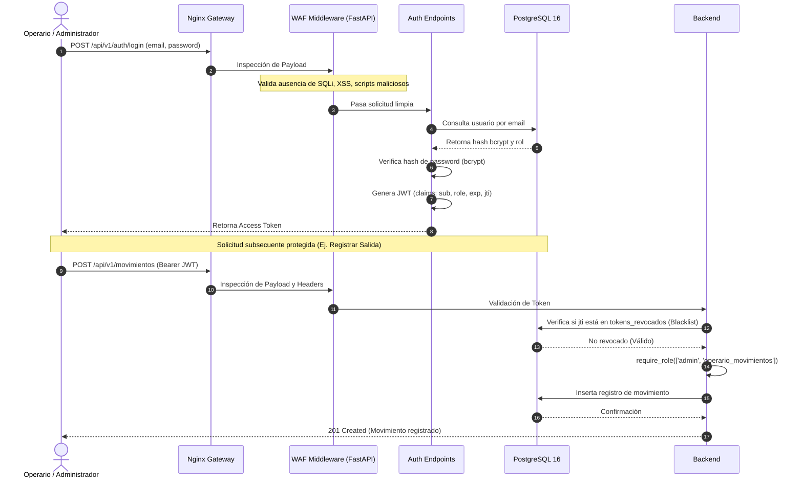
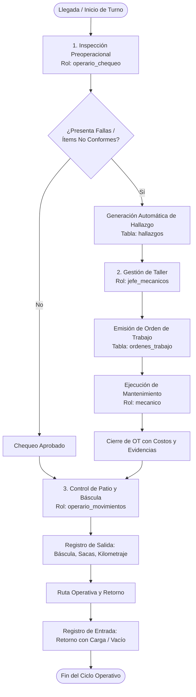

# 🏛️ Arquitectura del Sistema - SCV (Sistema de Control Vehicular)

**Comercializadora Normetales S.A.S.**  
*Área de Desarrollo de Software y Sistemas*  
*Versión de Arquitectura: 2.0 (Microservicios Modulares Contenerizados)*

---

## 📌 1. Visión General y Propósito

El **Sistema de Control Vehicular (SCV)** es una solución tecnológica integral diseñada para resolver la fragmentación y falta de trazabilidad en las operaciones de patio, control de báscula, inspecciones de seguridad vial preoperacionales y mantenimiento mecánico de la flota vehicular de Comercializadora Normetales S.A.S.

Reemplaza los antiguos formularios dispersos de Google Forms y las listas de chequeo físicas en papel por una **Arquitectura en Capas desacoplada, escalable y contenerizada**, con alta disponibilidad y capacidades de trabajo como Progressive Web App (PWA).

---

## 🧱 2. Diagrama de Arquitectura Global

```mermaid
graph TD
    ClientBrowser["📱 Dispositivos Móviles / Tablets / PC<br/>(PWA Navegadores Web)"]
    
    subgraph DMZ ["Perímetro de Red / DMZ"]
        Nginx["🛡️ NGINX Gateway & Reverse Proxy<br/>- Terminación SSL/TLS (Let's Encrypt)<br/>- Enrutamiento de Tráfico<br/>- Headers de Seguridad (HSTS, CSP)<br/>- Compresión GZIP"]
    end
    
    subgraph InternalNet ["Red Interna de Contenedores (scv-network)"]
        Frontend["🎨 Frontend SPA (React + Vite)<br/>- Puerto interno 80<br/>- Shell PWA estático"]
        
        Backend["⚙️ Backend REST API (FastAPI)<br/>- Puerto interno 8000<br/>- WAF Middleware (SQLi/XSS Filter)<br/>- Dependency Injection & RBAC<br/>- SQLAlchemy 2.0 ORM"]
        
        Database[("🗄️ Base de Datos Relacional<br/>PostgreSQL 16 Alpine<br/>- Puerto interno 5432<br/>- Volumen persistente")]
    end

    ClientBrowser -->|HTTP:80 / HTTPS:443| Nginx
    Nginx -->|/ (Rutas web)| Frontend
    Nginx -->|/api/v1 (REST)| Backend
    Nginx -->|/docs & /openapi.json| Backend
    Backend -->|Conexión Pooling TCP:5432| Database

    classDef edgeClass fill:#1e293b,stroke:#3b82f6,stroke-width:2px,color:#fff;
    classDef compClass fill:#0f172a,stroke:#10b981,stroke-width:2px,color:#fff;
    class Nginx,Frontend,Backend,Database compClass;
    class ClientBrowser edgeClass;
```

---

## 🧩 3. Componentes de la Arquitectura

### 3.1. Puerta de Enlace y Proxy Inverso (`nginx-gateway`)
* **Tecnología:** Nginx Alpine.
* **Responsabilidades:**
  * **Punto único de entrada (Single Point of Entry):** Expone únicamente los puertos estándar `80` (HTTP) y `443` (HTTPS) hacia internet o red corporativa.
  * **Terminación SSL/TLS:** En producción gestiona los certificados criptográficos emitidos automáticamente por Let's Encrypt (Certbot). Redirige forzosamente todo tráfico HTTP hacia HTTPS.
  * **Enrutamiento Inteligente:**
    * Solicitudes a `/api/v1/*` y `/docs` se despachan internamente hacia el backend FastAPI (`api-services:8000`).
    * El resto de rutas se despacha hacia el contenedor de la aplicación cliente (`client-app:80`).
  * **Hardening de Seguridad HTTP:** Inyección de encabezados de protección contra ataques web comunes:
    * `X-Frame-Options: SAMEORIGIN` (prevención de Clickjacking).
    * `X-Content-Type-Options: nosniff` (prevención de MIME-type sniffing).
    * `X-XSS-Protection: 1; mode=block`.
    * `Strict-Transport-Security (HSTS)` en producción.

### 3.2. Capa de Servicios Backend (`api-services`)
* **Tecnología:** Python 3.11+ / FastAPI con servidor ASGI Uvicorn.
* **Patrón de Diseño:** Clean Architecture por módulos de dominio (`app/api/v1/endpoints/`, `app/models/`, `app/schemas/`, `app/core/`).
* **Responsabilidades:**
  * Exposición de API RESTful con validación estricta de esquemas entrada/salida usando **Pydantic v2**.
  * Mapeo relacional objeto-relacional mediante **SQLAlchemy 2.0** en modo tipado (`Mapped`, `mapped_column`).
  * Gestión de migraciones y evolución de la base de datos con **Alembic**.
  * Generación dinámica de reportes consolidados (CSV, Excel).
  * Control de sesiones sin estado (Stateless) mediante **JSON Web Tokens (JWT)**.
  * Inyección de dependencias para sesión de base de datos (`get_db`) y control de roles (`require_role`).

### 3.3. Capa de Interfaz de Usuario (`client-app`)
* **Tecnología:** React 18, Vite, Lucide Icons, CSS Modular / Tokens de Diseño.
* **Arquitectura de Frontend:** Single Page Application (SPA) con arquitectura basada en componentes funcionales y Hooks.
* **Capacidades PWA:**
  * Manifiesto de aplicación web (`manifest.webmanifest`) configurado para instalación en dispositivos móviles Android/iOS y escritorio.
  * Tema visual de **Alto Contraste / Modo Oscuro** diseñado específicamente para visualización en exteriores bajo luz solar directa en patios de acopio y talleres industriales.
  * Servicio de cliente API centralizado (`src/services/api.js`) con manejo de tokens JWT en `localStorage`, inyección automática de cabeceras `Authorization: Bearer <token>` y captura global de respuestas `401 Unauthorized` para redirección automática al Login.

### 3.4. Capa de Persistencia (`postgres-db`)
* **Tecnología:** PostgreSQL 16 sobre Linux Alpine.
* **Responsabilidades:**
  * Almacenamiento seguro, transaccional (ACID) y relacional de las operaciones.
  * Integridad referencial con claves foráneas, restricciones de chequeo (`CHECK`) e índices optimizados para búsquedas operativas y filtrado por fechas.
  * Persistencia en volúmenes Docker nombrados (`scv_pgdata` en desarrollo, `scv_pgdata_prod` en producción).

---

## 🔒 4. Modelo de Seguridad y Protección



### 4.1. Web Application Firewall (WAF) a Nivel de Aplicación
Implementado mediante un middleware asíncrono (`WAFMiddleware`) en Starlette/FastAPI:
* Inspecciona de forma transparente la ruta decodificada, los parámetros de consulta (query string) y cabeceras sensibles (`User-Agent`, `Referer`, `X-Forwarded-For`).
* Detecta y bloquea instantáneamente con código HTTP `403 Forbidden` patrones de:
  * **SQL Injection:** Expresiones de unión (`union select`), tautologías (`or 1=1`), sentencias de destrucción (`drop table`).
  * **Cross-Site Scripting (XSS):** Etiquetas `<script>`, esquemas `javascript:`, manejadores de eventos en línea (`onload`, `onerror`, `onclick`).
  * **Path Traversal:** Intentos de escape de directorio (`../`).
  * **Command Injection:** Concatenaciones de comandos unix (`cat`, `whoami`, `curl`, etc.).

### 4.2. Autenticación y Revocación de Tokens (JWT + Blacklist)
* El acceso a los recursos protegidos se basa en el estándar **RFC 7519 (JWT)** firmado con algoritmo simétrico **HMAC-SHA256 (HS256)** y secreto criptográfico.
* **Problema resuelto en la arquitectura:** Los tokens JWT son por naturaleza autónomos y válidos hasta su expiración. Para permitir un **Cierre de Sesión Seguro (Logout)**, cada token emitido contiene un identificador único `jti` (JWT ID).
* Al hacer `POST /api/v1/auth/logout`, el `jti` se persiste en la tabla `tokens_revocados`. En cada petición entrante, el middleware de autenticación valida que el token no pertenezca a la lista negra.

### 4.3. Control de Acceso Basado en Roles (RBAC)
El sistema implementa 5 roles jerárquicos y segregados:
1. **`admin`**: Acceso total al sistema, configuraciones, gestión de usuarios, auditoría forense y exportación de reportes globales.
2. **`operario_movimientos`**: Registro de entrada y salida de vehículos en patio, captura de pesos de báscula, sacas y estado del cajón.
3. **`operario_chequeo`**: Diligenciamiento de las listas de chequeo preoperacional y reporte de novedades del vehículo antes de iniciar ruta.
4. **`mecanico`**: Consulta de anomalías asignadas, ejecución de actividades técnicas y registro de evidencias y costos de repuestos.
5. **`jefe_mecanicos`**: Diagnóstico de hallazgos, emisión y aprobación de órdenes de trabajo (OT), asignación de responsables y cierre de mantenimiento.

---

## 🔀 5. Flujos de Integración de Negocio



---

## ⚙️ 6. Decisiones de Arquitectura Relevantes (ADR)

* **ADR-01: Separación de Movimientos y Chequeos:**  
  * *Decisión:* Las tablas `movimientos` y `chequeos` no tienen clave foránea directa entre sí.
  * *Motivo:* Un vehículo puede realizar múltiples movimientos de entrada y salida al día con un solo chequeo matutino, o puede ser inspeccionado en taller sin salir de las instalaciones. Se cruzan lógicamente mediante `vehiculo_id` y fecha.
* **ADR-02: Unificación de Perfil de Usuarios y Conductores:**  
  * *Decisión:* La tabla `usuarios` almacena tanto las credenciales de acceso al sistema como los datos de conducción (cédula, licencia, categoría, vigencia).
  * *Motivo:* En la operación real de la empresa, los conductores frecuentemente actúan como operarios que diligencian su propia inspección en el celular.
* **ADR-03: Contenerización Total con Docker:**  
  * *Decisión:* Todo el stack (frontend, backend, base de datos, reverse proxy) corre en contenedores Docker orquestados por Docker Compose.
  * *Motivo:* Garantiza paridad absoluta entre el entorno local de desarrollo y el servidor en la nube (VPS en Google Cloud), eliminando problemas de 'en mi máquina funciona'.
