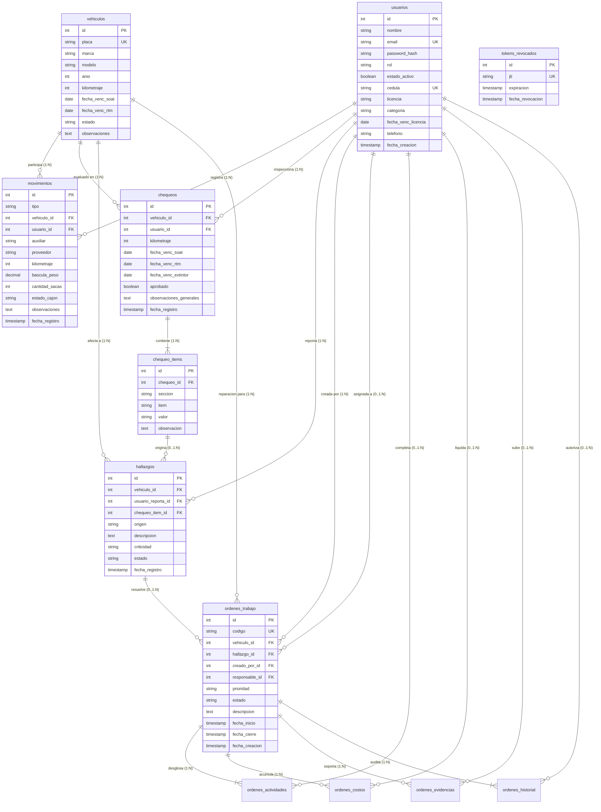

# 🗄️ Modelo Relacional y Diccionario de Base de Datos - SCV

**Comercializadora Normetales S.A.S.**  
*Motor de Base de Datos: PostgreSQL 16 (Alpine)*  
*Esquema Oficial: v2.0*

---

## 📌 1. Visión General del Modelo de Datos

La base de datos del **Sistema de Control Vehicular (SCV)** implementa un modelo relacional normalizado en 3FN (Tercera Forma Normal) con extensiones de auditoría inmutable. Está diseñada para operar de forma confiable, garantizando la integridad de datos transaccionales de báscula y el cumplimiento legal de las inspecciones de seguridad vial preoperacionales (Norma Técnica y Ministerio de Transporte de Colombia).

### Principios Fundamentales del Diseño:
1. **Desacoplamiento Operativo:** Las tablas transaccionales `movimientos` y `chequeos` no dependen una de la otra. Un vehículo puede ingresar/salir varias veces sin necesidad de un nuevo chequeo, o ser inspeccionado en reposo en patio sin salir.
2. **Tabla Unificada de Usuarios y Personal:** Se unifican las cuentas con login y los perfiles de conductores en una sola entidad (`usuarios`), facilitando la gestión centralizada de licencias y categorías sin redundancia.
3. **Auditoría Forense Inmutable:** El ciclo de mantenimiento mecánico registra cada cambio de estado, actividad y asignación en `ordenes_historial`, capturando IP del cliente y User-Agent.

---

## 🗺️ 2. Diagrama Entidad-Relación (ERD)



---

## 📖 3. Diccionario de Datos Detallado

### 3.1. Tabla: `usuarios`
Cuentas de usuario autorizadas para ingresar a la plataforma y catálogo de personal operativo (conductores y mecánicos).

| Columna | Tipo de Dato | Nulo | PK/FK/UK | Default | Descripción y Reglas de Negocio |
|---|---|---|---|---|---|
| `id` | `SERIAL` | NO | **PK** | Autoincrement | Identificador único secuencial del usuario. |
| `nombre` | `VARCHAR(150)` | NO | - | - | Nombre y apellido completo del colaborador. |
| `email` | `VARCHAR(150)` | NO | **UK** | - | Correo institucional usado para login. Formato email válido. |
| `password_hash` | `VARCHAR(255)` | NO | - | - | Contraseña cifrada mediante hash Bcrypt con Salt aleatorio. |
| `rol` | `VARCHAR(50)` | NO | - | - | Rol RBAC. Restricción `CHECK (rol IN ('admin', 'operario_movimientos', 'operario_chequeo', 'mecanico', 'jefe_mecanicos'))`. |
| `estado_activo` | `BOOLEAN` | NO | - | `TRUE` | Permite suspender el acceso sin perder historial referencial. |
| `cedula` | `VARCHAR(30)` | SÍ | **UK** | `NULL` | Documento de identidad nacional para nómina y legal. |
| `licencia` | `VARCHAR(50)` | SÍ | - | `NULL` | Número de licencia de conducción del operador vehicular. |
| `categoria` | `VARCHAR(10)` | SÍ | - | `NULL` | Categoría de conducción: `CHECK (categoria IN ('A1','A2','B1','B2','B3','C1','C2','C3'))`. |
| `fecha_venc_licencia` | `DATE` | SÍ | - | `NULL` | Fecha de caducidad para emitir alertas en el Dashboard. |
| `telefono` | `VARCHAR(30)` | SÍ | - | `NULL` | Teléfono de contacto de emergencia o WhatsApp. |
| `fecha_creacion` | `TIMESTAMPTZ` | NO | - | `NOW()` | Timestamp de registro del usuario en la base de datos. |
| `fecha_actualizacion` | `TIMESTAMPTZ` | NO | - | `NOW()` | Timestamp de última modificación del registro. |

*Índices:* `idx_usuarios_rol`, `idx_usuarios_email`, `idx_usuarios_cedula`.

---

### 3.2. Tabla: `vehiculos`
Padrón maestro de vehículos de carga y utilitarios de la compañía.

| Columna | Tipo de Dato | Nulo | PK/FK/UK | Default | Descripción y Reglas de Negocio |
|---|---|---|---|---|---|
| `id` | `SERIAL` | NO | **PK** | Autoincrement | Identificador primario del vehículo. |
| `placa` | `VARCHAR(10)` | NO | **UK** | - | Placa alfanumérica única (ej. `TRK-101`, `WBE450`). |
| `marca` | `VARCHAR(60)` | NO | - | - | Marca fabricante (ej. `Chevrolet`, `Hino`, `Foton`). |
| `modelo` | `VARCHAR(60)` | NO | - | - | Línea o modelo comercial (ej. `NPR Turbo`, `Dutro 300`). |
| `año` | `INTEGER` | SÍ | - | `NULL` | Año de fabricación: `CHECK (año > 1950 AND año < 2100)`. |
| `kilometraje` | `INTEGER` | NO | - | `0` | Odómetro actual acumulado: `CHECK (kilometraje >= 0)`. |
| `fecha_venc_soat` | `DATE` | SÍ | - | `NULL` | Vencimiento del Seguro Obligatorio (SOAT). |
| `fecha_venc_rtm` | `DATE` | SÍ | - | `NULL` | Vencimiento de la Revisión Técnico-Mecánica. |
| `estado` | `VARCHAR(30)` | NO | - | `'activo'` | Estado operativo: `CHECK (estado IN ('activo', 'en_taller', 'inactivo', 'baja'))`. |
| `observaciones` | `TEXT` | SÍ | - | `NULL` | Comentarios técnicos o especificaciones de carrocería. |
| `fecha_creacion` | `TIMESTAMPTZ` | NO | - | `NOW()` | Fecha y hora de alta en la plataforma. |

*Índices:* `idx_vehiculos_placa`, `idx_vehiculos_estado`.

---

### 3.3. Tabla: `movimientos`
Bitácora de despacho logístico: entradas y salidas por báscula.

| Columna | Tipo de Dato | Nulo | PK/FK/UK | Default | Descripción |
|---|---|---|---|---|---|
| `id` | `SERIAL` | NO | **PK** | Autoincrement | ID de transacción de movimiento. |
| `tipo` | `VARCHAR(20)` | NO | - | `'salida'` | Tipo de movimiento: `CHECK (tipo IN ('entrada', 'salida'))`. |
| `vehiculo_id` | `INTEGER` | NO | **FK** | - | Clave foránea hacia `vehiculos.id` (`ON DELETE RESTRICT`). |
| `usuario_id` | `INTEGER` | NO | **FK** | - | Clave foránea hacia `usuarios.id` (Operario de Báscula/Despacho). |
| `auxiliar` | `VARCHAR(150)` | SÍ | - | `NULL` | Nombre del ayudante o personal auxiliar a bordo. |
| `proveedor` | `VARCHAR(150)` | SÍ | - | `NULL` | Destino comercial, cliente o proveedor receptor. |
| `kilometraje` | `INTEGER` | SÍ | - | `NULL` | Kilometraje leído al cruzar la caseta de báscula. |
| `bascula_peso` | `NUMERIC(10,2)` | SÍ | - | `NULL` | Peso bruto registrado por la báscula en kilogramos (kg). |
| `cantidad_sacas` | `INTEGER` | SÍ | - | `0` | Número de sacas de material metálico/reciclado cargado. |
| `estado_cajon` | `VARCHAR(50)` | SÍ | - | `'bueno'` | Condición del furgón: `CHECK (estado_cajon IN ('bueno', 'regular', 'sucio', 'dañado'))`. |
| `observaciones` | `TEXT` | SÍ | - | `NULL` | Notas adicionales de la carga o precintos de seguridad. |
| `fecha_registro` | `TIMESTAMPTZ` | NO | - | `NOW()` | Marca de tiempo inmutable del cruce por báscula. |

*Índices:* `idx_movimientos_vehiculo`, `idx_movimientos_usuario`, `idx_movimientos_fecha`.

---

### 3.4. Tabla: `chequeos`
Cabecera de inspección preoperacional diaria de seguridad vial.

| Columna | Tipo de Dato | Nulo | PK/FK/UK | Default | Descripción |
|---|---|---|---|---|---|
| `id` | `SERIAL` | NO | **PK** | Autoincrement | ID único del reporte de inspección preoperacional. |
| `vehiculo_id` | `INTEGER` | NO | **FK** | - | Clave foránea hacia `vehiculos.id` (`ON DELETE RESTRICT`). |
| `usuario_id` | `INTEGER` | NO | **FK** | - | Clave foránea hacia `usuarios.id` (Inspector o Conductor evaluador). |
| `kilometraje` | `INTEGER` | NO | - | - | Kilometraje al iniciar el turno: `CHECK (kilometraje >= 0)`. |
| `fecha_venc_soat` | `DATE` | SÍ | - | `NULL` | Fecha SOAT verificada físicamente en cabina. |
| `fecha_venc_rtm` | `DATE` | SÍ | - | `NULL` | Fecha RTM verificada físicamente en cabina. |
| `fecha_venc_extintor` | `DATE` | SÍ | - | `NULL` | Fecha de recarga del extintor de seguridad vial. |
| `aprobado` | `BOOLEAN` | NO | - | `TRUE` | `TRUE` si todos los ítems críticos fueron aprobados; `FALSE` si hubo rechazo. |
| `observaciones_generales`| `TEXT` | SÍ | - | `NULL` | Dictamen general del conductor sobre el vehículo. |
| `fecha_registro` | `TIMESTAMPTZ` | NO | - | `NOW()` | Fecha y hora exacta de captura de la lista. |

*Índices:* `idx_chequeos_vehiculo`, `idx_chequeos_usuario`, `idx_chequeos_fecha`.

---

### 3.5. Tabla: `chequeo_items`
Detalle de evaluación de cada uno de los ~45 ítems normativos de la lista de chequeo.

| Columna | Tipo de Dato | Nulo | PK/FK/UK | Default | Descripción |
|---|---|---|---|---|---|
| `id` | `SERIAL` | NO | **PK** | Autoincrement | ID único del ítem inspeccionado. |
| `chequeo_id` | `INTEGER` | NO | **FK** | - | Clave foránea hacia `chequeos.id` (`ON DELETE CASCADE`). |
| `seccion` | `VARCHAR(60)` | NO | - | - | Categoría técnica (ej. `luces`, `frenos`, `llantas`, `fluidos`, `cabina`). |
| `item` | `VARCHAR(100)` | NO | - | - | Nombre del componente inspeccionado (ej. `freno_principal`, `luces_altas`). |
| `valor` | `VARCHAR(30)` | NO | - | - | Resultado: `CHECK (valor IN ('conforme', 'no_conforme', 'no_aplica'))`. |
| `observacion` | `TEXT` | SÍ | - | `NULL` | Detalle específico si el resultado es no conforme. |

*Índices:* `idx_chequeo_items_chequeo`.

---

### 3.6. Tabla: `hallazgos`
Bandeja de novedades y averías mecánicas detectadas en inspecciones o reportadas en ruta.

| Columna | Tipo de Dato | Nulo | PK/FK/UK | Default | Descripción |
|---|---|---|---|---|---|
| `id` | `SERIAL` | NO | **PK** | Autoincrement | ID del hallazgo técnico. |
| `vehiculo_id` | `INTEGER` | NO | **FK** | - | Vehículo afectado (`ON DELETE RESTRICT`). |
| `usuario_reporta_id` | `INTEGER` | NO | **FK** | - | Usuario que identificó el problema (`ON DELETE RESTRICT`). |
| `chequeo_item_id` | `INTEGER` | SÍ | **FK** | `NULL` | Referencia opcional al ítem de inspección no conforme (`ON DELETE SET NULL`). |
| `origen` | `VARCHAR(30)` | NO | - | - | Origen del reporte: `CHECK (origen IN ('chequeo', 'movimiento', 'manual'))`. |
| `descripcion` | `TEXT` | NO | - | - | Diagnóstico o descripción de la falla. |
| `criticidad` | `VARCHAR(20)` | NO | - | `'media'` | Nivel de urgencia: `CHECK (criticidad IN ('baja', 'media', 'alta', 'critica'))`. |
| `estado` | `VARCHAR(30)` | NO | - | `'abierto'` | Estado de gestión: `CHECK (estado IN ('abierto', 'en_orden', 'resuelto', 'descartado'))`. |
| `fecha_registro` | `TIMESTAMPTZ` | NO | - | `NOW()` | Fecha y hora de captura de la anomalía. |

*Índices:* `idx_hallazgos_vehiculo`, `idx_hallazgos_estado`, `idx_hallazgos_criticidad`.

---

### 3.7. Tabla: `ordenes_trabajo`
Encabezado de la Orden de Trabajo (OT) para intervención técnica en taller automotriz.

| Columna | Tipo de Dato | Nulo | PK/FK/UK | Default | Descripción |
|---|---|---|---|---|---|
| `id` | `SERIAL` | NO | **PK** | Autoincrement | ID de la Orden de Trabajo. |
| `codigo` | `VARCHAR(30)` | NO | **UK** | - | Código correlativo oficial de taller (ej. `OT-2026-0001`). |
| `vehiculo_id` | `INTEGER` | NO | **FK** | - | Vehículo intervenido (`ON DELETE RESTRICT`). |
| `hallazgo_id` | `INTEGER` | SÍ | **FK** | `NULL` | Hallazgo original que motivó la orden (`ON DELETE SET NULL`). |
| `creado_por_id` | `INTEGER` | NO | **FK** | - | Jefe de taller o admin que generó la OT (`ON DELETE RESTRICT`). |
| `responsable_id` | `INTEGER` | SÍ | **FK** | `NULL` | Mecánico líder asignado (`ON DELETE SET NULL`). |
| `prioridad` | `VARCHAR(20)` | NO | - | `'media'` | Urgencia: `CHECK (prioridad IN ('baja', 'media', 'alta', 'urgente'))`. |
| `estado` | `VARCHAR(30)` | NO | - | `'pendiente'`| Estado: `CHECK (estado IN ('pendiente', 'en_progreso', 'completada', 'cancelada'))`. |
| `descripcion` | `TEXT` | NO | - | - | Procedimiento de reparación o mantenimiento a ejecutar. |
| `fecha_inicio` | `TIMESTAMPTZ` | SÍ | - | `NULL` | Inicio real de los trabajos mecánicos. |
| `fecha_cierre` | `TIMESTAMPTZ` | SÍ | - | `NULL` | Finalización formal y entrega del vehículo. |
| `fecha_creacion` | `TIMESTAMPTZ` | NO | - | `NOW()` | Fecha de radicación de la orden en el sistema. |

*Índices:* `idx_ordenes_codigo`, `idx_ordenes_vehiculo`, `idx_ordenes_responsable`, `idx_ordenes_estado`.

---

### 3.8. Tablas Complementarias de Taller (`ordenes_actividades`, `ordenes_costos`, `ordenes_evidencias`)

#### `ordenes_actividades`: Tareas y pasos específicos dentro de la OT.
* `id` (`SERIAL PRIMARY KEY`)
* `orden_id` (`INTEGER NOT NULL REFERENCES ordenes_trabajo(id) ON DELETE CASCADE`)
* `titulo` (`VARCHAR(150) NOT NULL`)
* `descripcion` (`TEXT`)
* `estado` (`VARCHAR(30) CHECK (estado IN ('pendiente', 'en_progreso', 'completada'))`)
* `completado_por_id` (`INTEGER REFERENCES usuarios(id) ON DELETE SET NULL`)
* `fecha_completado` (`TIMESTAMPTZ`)

#### `ordenes_costos`: Liquidación de gastos de mantenimiento.
* `id` (`SERIAL PRIMARY KEY`)
* `orden_id` (`INTEGER NOT NULL REFERENCES ordenes_trabajo(id) ON DELETE CASCADE`)
* `tipo_gasto` (`VARCHAR(50) CHECK (tipo_gasto IN ('repuesto', 'mano_obra', 'servicio_externo', 'herramienta', 'otro'))`)
* `descripcion` (`VARCHAR(200) NOT NULL`)
* `cantidad` (`NUMERIC(10,2) CHECK (cantidad > 0)`)
* `valor_unitario` (`NUMERIC(14,2) CHECK (valor_unitario >= 0)`)
* `total_calculado` (`NUMERIC(14,2) CHECK (total_calculado >= 0)`)
* `registrado_por_id` (`INTEGER REFERENCES usuarios(id) ON DELETE SET NULL`)
* `fecha_registro` (`TIMESTAMPTZ DEFAULT NOW()`)

#### `ordenes_evidencias`: Adjuntos documentales y fotografías.
* `id` (`SERIAL PRIMARY KEY`)
* `orden_id` (`INTEGER NOT NULL REFERENCES ordenes_trabajo(id) ON DELETE CASCADE`)
* `tipo` (`VARCHAR(50) CHECK (tipo IN ('foto_antes', 'foto_durante', 'foto_despues', 'factura', 'documento', 'otro'))`)
* `ruta_archivo` (`VARCHAR(500) NOT NULL`)
* `descripcion` (`TEXT`)
* `subido_por_id` (`INTEGER REFERENCES usuarios(id) ON DELETE SET NULL`)
* `fecha_registro` (`TIMESTAMPTZ DEFAULT NOW()`)

---

### 3.9. Tabla: `ordenes_historial` (Auditoría Forense Inmutable)
* `id` (`SERIAL PRIMARY KEY`)
* `orden_id` (`INTEGER NOT NULL REFERENCES ordenes_trabajo(id) ON DELETE CASCADE`)
* `usuario_id` (`INTEGER REFERENCES usuarios(id) ON DELETE SET NULL`)
* `accion` (`VARCHAR(60) NOT NULL`): Ej. `creacion`, `cambio_estado`, `asignacion_mecanico`.
* `campo_modificado` (`VARCHAR(100)`): Columna afectada.
* `valor_anterior` (`TEXT`): Valor previo a la mutación.
* `valor_nuevo` (`TEXT`): Nuevo valor persistido.
* `ip_usuario` (`VARCHAR(50)`): Dirección IP pública o de intranet del cliente solicitante.
* `user_agent` (`VARCHAR(255)`): Navegador y sistema operativo del usuario.
* `fecha_registro` (`TIMESTAMPTZ DEFAULT NOW()`): Registro cronológico inalterable.

---

### 3.10. Tabla: `tokens_revocados` (Seguridad JWT)
* `id` (`SERIAL PRIMARY KEY`)
* `jti` (`VARCHAR(255) UNIQUE NOT NULL`): Identificador único criptográfico del JWT emitido.
* `expiracion` (`TIMESTAMPTZ NOT NULL`): Momento exacto de caducidad del token original.
* `fecha_revocacion` (`TIMESTAMPTZ DEFAULT NOW()`): Momento en que el usuario ejecutó logout.

---

## 🛠️ 4. Gestión de Migraciones con Alembic

Las estructuras de datos son gestionadas mediante **Alembic** dentro del contenedor backend:

```bash
# Aplicar todas las migraciones pendientes hacia la última versión
docker compose exec api-services alembic upgrade head

# Generar una nueva migración automática tras modificar modelos SQLAlchemy
docker compose exec api-services alembic revision --autogenerate -m "descripcion_del_cambio"

# Revertir la última migración aplicada (Rollback)
docker compose exec api-services alembic downgrade -1

# Ver historial de revisiones aplicadas
docker compose exec api-services alembic history
```

---

## 💾 5. Política de Copias de Seguridad (Backups)

El script automatizado `backup-db.sh` realiza volcados lógicos comprimidos:
1. **Ejecución manual:** `./backup-db.sh`
2. **Formato generado:** `/backups/scv_backup_YYYYMMDD_HHMMSS.sql.gz`
3. **Retención automática:** Mantiene los respaldos de los últimos 7 días y depura automáticamente los más antiguos.
4. **Procedimiento de Restauración:**
```bash
# Descomprimir y restaurar backup en PostgreSQL
gunzip < /backups/scv_backup_20261005_120000.sql.gz | docker compose exec -T postgres-db psql -U scv_user -d scv_database
```
