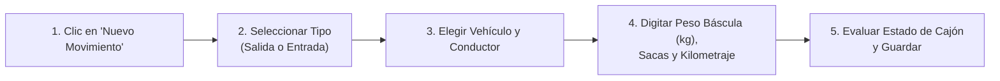
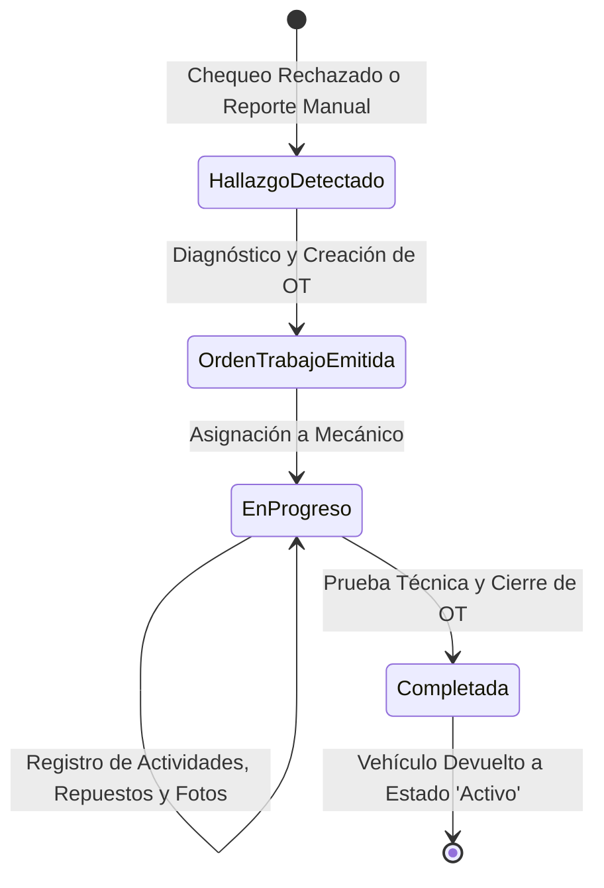

# 📘 Manual de Usuario y Guía de Operación Funcional - SCV

**Comercializadora Normetales S.A.S.**  
*Sistema de Control Vehicular (SCV) - Versión 2.0 PWA*  
*Área de Logística, Seguridad Vial y Mantenimiento de Flota*

---

## 📌 1. Introducción y Propósito de la Plataforma

El **Sistema de Control Vehicular (SCV)** es una aplicación web progresiva (PWA) creada específicamente para digitalizar y optimizar tres procesos neurálgicos de Comercializadora Normetales S.A.S.:
1. **Control de Despacho y Báscula:** Registro confiable de entradas, salidas, pesaje de material en kilogramos, sacas y estado del cajón.
2. **Inspecciones Preoperacionales de Seguridad Vial:** Cumplimiento estricto del Plan Estratégico de Seguridad Vial (PESV) y normatividad colombiana de transporte, reemplazando las planillas de papel.
3. **Mantenimiento y Taller Automotriz:** Trazabilidad integral de anomalías, emisión de Órdenes de Trabajo (OT), control de repuestos, costos y evidencias fotográficas.

---

## 🔐 2. Acceso a la Plataforma y Roles de Usuario

### 2.1. Ingreso al Sistema
1. Abra el navegador web (Google Chrome recomendado) en su teléfono móvil, tableta o computador.
2. Ingrese a la dirección proporcionada por el área de sistemas (ej. `http://localhost`, `http://192.168.1.X` en red local, o el dominio institucional en internet).
3. En la pantalla de bienvenida, digite su correo institucional y contraseña asignada, y presione **"Iniciar Sesión"**.

### 2.2. Perfiles y Credenciales Iniciales de Prueba
Para familiarización del personal en pruebas o capacitación, se encuentran preconfiguradas las siguientes cuentas:

| Rol | Correo de Acceso | Contraseña Inicial | Alcance Funcional en el Sistema |
|---|---|---|---|
| **Administrador** | `admin@scv.local` | `admin123` | Control total, gestión de usuarios, vehículos, analítica, auditoría y reportes gerenciales. |
| **Operario de Báscula** | `despacho@scv.local` | `admin123` | Registro de movimientos de entrada y salida, captura de peso bruto y sacas. |
| **Inspector / Conductor** | `carlos.chofer@scv.local` | `admin123` | Diligenciamiento de la lista de chequeo preoperacional diaria de su vehículo. |
| **Mecánico** | `mecanico@scv.local` | `admin123` | Consulta de fallas asignadas, ejecución de tareas técnicas y registro de gastos/repuestos. |
| **Jefe de Taller** | `jefe.taller@scv.local` | `admin123` | Diagnóstico de hallazgos, emisión y aprobación de Órdenes de Trabajo y cierre de reparaciones. |

---

## 🚛 3. Módulo de Despacho y Báscula (Operario de Movimientos)

Este módulo es utilizado por el personal de garita y báscula para controlar el flujo de carga que entra y sale de las plantas de acopio.

### 3.1. Pasos para Registrar un Despacho (Salida de Planta)
1. Inicie sesión con su usuario de báscula y diríjase a la sección **"Movimientos"** en el menú lateral.
2. Haga clic en el botón azul **"Registrar Movimiento"**. Se desplegará el modal interactivo.
3. Complete los siguientes campos obligatorios y opcionales:
   * **Tipo:** Seleccione `Salida`.
   * **Vehículo:** Seleccione la placa del vehículo (ej. `TRK-101 - Chevrolet NPR`).
   * **Auxiliar (Opcional):** Nombre del acompañante o ayudante de cargue.
   * **Proveedor / Destino:** Nombre de la empresa o cliente destinatario.
   * **Kilometraje:** Lectura actual del odómetro al cruzar la báscula.
   * **Peso Báscula (kg):** Peso total bruto registrado por la báscula de pesaje en kilogramos.
   * **Cantidad de Sacas:** Número de sacas de material cargadas.
   * **Estado del Cajón:** Seleccione entre `Bueno`, `Regular`, `Sucio` o `Dañado`.
   * **Observaciones:** Notas sobre precintos, amarres o particularidades de la carga.
4. Presione **"Guardar Movimiento"**. El registro quedará almacenado de forma permanente en la bitácora.

### 3.2. Pasos para Registrar un Retorno (Entrada a Planta)
* El procedimiento es idéntico al de salida, seleccionando el tipo `Entrada`. Permite verificar si el vehículo retorna cargado con materia prima o desocupado (tara).

---

## 📋 4. Módulo de Inspección Preoperacional (Conductor / Inspector)

Por disposiciones del Ministerio de Transporte y la política interna de seguridad vial, **ningún vehículo debe iniciar ruta sin diligenciar previamente su chequeo diario**.

### 4.1. Pasos para Realizar la Inspección Diaria
1. En el menú principal, ingrese a la pestaña **"Chequeos Preoperacionales"** y presione **"Nuevo Chequeo"**.
2. **Datos de Encabezado:**
   * Seleccione la placa del vehículo asignado.
   * Ingrese el kilometraje actual.
   * Verifique y confirme las fechas de vencimiento físicas que porta el vehículo en sus calcomanías/documentos: **SOAT**, **Revisión Técnico-Mecánica (RTM)** y **Extintor**.
3. **Revisión de Ítems (Formulario Interactivo):**  
   Evalúe cada uno de los sistemas del vehículo, marcando una de tres opciones:
   * 🟢 **Conforme:** El componente se encuentra en óptimas condiciones mecánicas y de seguridad.
   * 🔴 **No Conforme:** El componente presenta desgaste severo, daño, fuga o falla. *(Al marcar esta opción, es obligatorio escribir una observación descriptiva).*
   * ⚪ **No Aplica:** El ítem no corresponde al tipo de vehículo inspeccionado.

### 4.2. Sistemas Evaluados en la Lista Oficial:
* **Luces:** Altas, bajas, direccionales delanteras y traseras, reversa, freno, estacionamiento y exploradoras.
* **Frenos:** Freno de servicio (pedal), freno de seguridad/parqueo (palanca), estado de mangueras y ausencia de fugas de aire o líquido.
* **Llantas:** Presión de inflado, profundidad de labrado (mínimo 2 mm), torque de tuercas/espárragos y llanta de repuesto en condiciones de uso.
* **Fluidos y Motor:** Nivel de aceite de motor, refrigerante, líquido de frenos, líquido hidráulico y combustible.
* **Cabina y Equipamiento:** Cinturones de seguridad, espejos retrovisores, plumillas limpiaparabrisas, pito/bocina, botiquín reglamentario, kit de carretera y extintor con carga vigente.

> [!WARNING]
> **Generación Automática de Hallazgos:**  
> Si usted marca uno o más ítems críticos como **"No Conforme"**, el sistema automáticamente catalogará el chequeo como **RECHAZADO**, creará una alerta roja en el Dashboard y enviará la anomalía a la bandeja de trabajo del taller mecánico.

---

## 🔧 5. Módulo de Mantenimiento y Taller (Mecánicos y Jefe de Taller)

Este módulo gestiona el ciclo de vida completo de reparaciones preventivas y correctivas de la flota.

### 5.1. Gestión de Hallazgos (Anomalías)
1. Diríjase a **"Mantenimiento"** > pestaña **"Hallazgos"**.
2. Revise las fallas pendientes reportadas por los conductores.
3. Si un hallazgo amerita intervención de taller, presione **"Evaluar y Convertir en OT"**.

### 5.2. Ciclo de una Orden de Trabajo (OT)
1. **Creación de la Orden:** El Jefe de Taller asigna un código (ej. `OT-2026-0042`), selecciona la prioridad (`Baja`, `Media`, `Alta` o `Urgente`) y designa al mecánico responsable.
2. **Actividades:** El mecánico asignado ingresa las tareas realizadas (ej. "Desmonte de campana", "Cambio de retenedores", "Purgado de circuito hidráulico").
3. **Costos y Repuestos:** Se digita cada pieza consumida o servicio externo contratado (ej. "Filtro de combustible Isuzu", valor unitario y cantidad). El sistema calcula automáticamente los costos totales de la intervención.
4. **Evidencias Fotográficas:** Permite adjuntar registros fotográficos del daño original (`foto_antes`) y de la pieza reparada (`foto_despues`) para respaldo de auditoría contable.
5. **Cierre de la Orden:** Una vez superadas las pruebas mecánicas, el Jefe de Taller pulsa **"Completar Orden"**. El vehículo queda liberado automáticamente en el sistema y vuelve a estar disponible para despachos de patio.

---

## 📊 6. Centro de Mando y Dashboard (Administrador)

El panel principal ofrece una visión panorámica de la operación en tiempo real:
* **Indicadores KPI Superiores:** Muestran en tiempo real el total de vehículos activos, vehículos detenidos en taller por reparación, volumen de despachos del día e inspecciones completadas.
* **Monitor de Alertas Críticas:** Notifica con antelación documentos reglamentarios por vencer (SOAT, RTM, licencias de conducción de choferes) y anomalías sin atender.
* **Gráfica de Actividad Horaria:** Curva de flujo de entradas y salidas para optimizar los horarios de báscula.
* **Descarga de Reportes:** Permite exportar consolidados de movimientos, inspecciones y balances financieros de taller directamente en formato compatible con Excel (.csv UTF-8).

---

## 📱 7. Instalación como PWA en Celulares y Tablets (Android)

La aplicación no requiere ser descargada desde tiendas comerciales como Google Play Store. Puede instalarse directamente desde el navegador de su teléfono:

1. Abra la aplicación en el navegador **Google Chrome** de su teléfono Android.
2. Toque el menú de los **tres puntos verticales** en la esquina superior derecha del navegador.
3. Seleccione la opción **"Instalar aplicación"** o **"Agregar a la pantalla principal"**.
4. Confirme en la ventana emergente pulsando **"Instalar"**.
5. ¡Listo! Se creará un ícono con el logo de **SCV** en el menú de aplicaciones de su dispositivo móvil, permitiendo abrirla en pantalla completa como una aplicación nativa.
