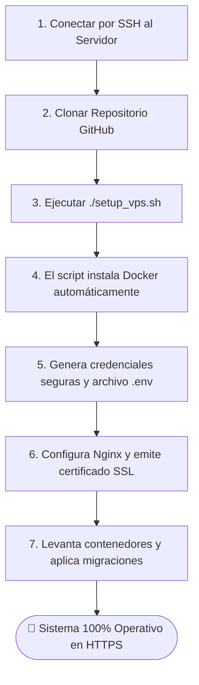

# 🚀 Guía de Despliegue, Infraestructura y Operaciones DevOps - SCV

**Comercializadora Normetales S.A.S.**  
*Entorno de Producción: Docker & Docker Compose en Linux (Ubuntu / Debian)*  
*Seguridad Perimetral: Nginx Reverse Proxy + Let's Encrypt SSL/TLS*

---

## 📌 1. Requisitos Previos de Infraestructura

Para desplegar el Sistema de Control Vehicular (SCV) en un entorno de producción (ya sea un VPS en la nube como Google Cloud Platform, AWS, DigitalOcean o un servidor local en planta), se deben cumplir los siguientes requisitos mínimos:

### 1.1. Servidor
* **Sistema Operativo:** Ubuntu 22.04 LTS o Debian 12 (64-bit).
* **Recursos de Hardware:**
  * CPU: Mínimo 1 vCPU (Recomendado 2 vCPUs).
  * Memoria RAM: Mínimo 2 GB (Recomendado 4 GB).
  * Almacenamiento: Mínimo 25 GB SSD.
* **Red y Firewall (Puertos obligatorios):**
  * `80/TCP` (HTTP): Obligatorio para tráfico web y verificación de Certbot.
  * `443/TCP` (HTTPS): Obligatorio para tráfico cifrado SSL/TLS.
  * `22/TCP` (SSH): Acceso administrativo de terminal remota.
  * *(Nota: El puerto `5432` de PostgreSQL y `8000` de FastAPI NUNCA deben exponerse públicamente; corren aislados dentro de la red interna de Docker).*

### 1.2. Dominio y DNS
* Disponer de un nombre de dominio o subdominio registrado (ej. `scv.normetales.com`).
* Crear un **Registro de tipo A** en su proveedor de DNS (Cloudflare, GoDaddy, Namecheap, etc.) apuntando directamente a la IP pública del servidor VPS:
  * Tipo: `A`
  * Host / Nombre: `@` o `scv`
  * Destino / Valor: `IP_PUBLICA_DEL_SERVIDOR`
  * TTL: Automático o 300 segundos.

---

## ⚡ 2. Opción A: Despliegue Automatizado "Zero to Hero" (`setup_vps.sh`)

Para simplificar la puesta en marcha al máximo sin requerir conocimientos avanzados de Linux o Docker, el repositorio cuenta con un asistente interactivo integral.



### Comandos de Ejecución Rápida:
```bash
# 1. Actualizar paquetes del sistema e instalar Git
sudo apt update && sudo apt install -y git

# 2. Clonar el repositorio oficial
git clone https://github.com/Bytestian76/SCV.git
cd SCV

# 3. Otorgar permisos de ejecución al instalador
chmod +x setup_vps.sh

# 4. Lanzar el asistente automático
./setup_vps.sh
```

### Respuestas en el Asistente:
1. Ingrese el nombre de dominio configurado (ej. `scv.normetales.com`).
2. Ingrese un correo electrónico institucional para las notificaciones de expiración de Let's Encrypt.
3. El script validará la conexión y configurará todos los contenedores de forma transparente.

---

## 🛠️ 3. Opción B: Despliegue Manual Paso a Paso

Si se requiere control granular sobre cada parámetro de configuración:

### Paso 1: Configurar Variables de Entorno Seguras
Copie la plantilla de variables de entorno y genere secretos criptográficos reales:
```bash
cp .env.example .env
nano .env
```

Parámetros críticos que deben configurarse obligatoriamente en `.env`:
```ini
# Configuración de Dominio y Certificados
DOMAIN=scv.normetales.com
CERTBOT_EMAIL=sistemas@normetales.com

# Base de Datos PostgreSQL 16
POSTGRES_DB=scv_production_db
POSTGRES_USER=scv_app_user
POSTGRES_PASSWORD=GenereUnaContrasenaUltraFuerteConSimbolos2026!

# Seguridad y Criptografía de la API Backend
SECRET_KEY=GenereUnaCadenaHexadecimalSeguraDeMinimo64Caracteres
ENVIRONMENT=production
ENABLE_API_DOCS=False
```

### Paso 2: Solución del Ciclo de Certificados SSL (Let's Encrypt)
Nginx requiere certificados SSL para arrancar en modo HTTPS, pero Certbot necesita que Nginx esté encendido para validar el dominio (el problema del huevo y la gallina). Ejecute el script provisto:
```bash
chmod +x init-letsencrypt.sh
./init-letsencrypt.sh
```
Este script genera certificados dummy temporales para permitir el arranque de Nginx, solicita los certificados legítimos a Let's Encrypt mediante el desafío HTTP-01 y luego recarga Nginx sin interrumpir el servicio.

### Paso 3: Construcción e Inicio de Contenedores de Producción
```bash
docker compose -f docker-compose.prod.yml up -d --build
```

### Paso 4: Ejecución de Migraciones y Semillas Iniciales
```bash
docker compose -f docker-compose.prod.yml exec api-services alembic upgrade head
```

---

## 🔄 4. Mantenimiento y Comandos de Administración Cotidiana

### 4.1. Visualizar Estado de los Servicios
```bash
docker compose -f docker-compose.prod.yml ps
```

### 4.2. Inspeccionar Logs en Tiempo Real
```bash
# Ver todos los logs del sistema
docker compose -f docker-compose.prod.yml logs -f

# Ver únicamente los logs del Backend FastAPI
docker compose -f docker-compose.prod.yml logs -f api-services

# Ver logs de peticiones y bloqueos WAF de Nginx
docker compose -f docker-compose.prod.yml logs -f nginx-gateway
```

### 4.3. Reiniciar o Detener la Aplicación
```bash
# Reinicio seguro de todos los servicios
docker compose -f docker-compose.prod.yml restart

# Detener los contenedores sin borrar volúmenes de datos
docker compose -f docker-compose.prod.yml down

# Detener y reiniciar reconstruyendo imágenes
docker compose -f docker-compose.prod.yml down
docker compose -f docker-compose.prod.yml up -d --build
```

### 4.4. Actualización del Sistema tras Nuevos Commits
```bash
# Obtener cambios más recientes de la rama main
git pull origin main

# Reconstruir y reiniciar contenedores con cero tiempo de inactividad
docker compose -f docker-compose.prod.yml up -d --build

# Aplicar cualquier nueva migración de base de datos
docker compose -f docker-compose.prod.yml exec api-services alembic upgrade head
```

---

## 💾 5. Política y Automatización de Respaldos (Backups)

El repositorio incluye el script `backup-db.sh`, el cual genera volcados binarios comprimidos de PostgreSQL (`.sql.gz`) con rotación automática de 7 días.

### 5.1. Ejecución Manual de Respaldo
```bash
chmod +x backup-db.sh
./backup-db.sh
```
Los respaldos se almacenarán en la carpeta `./backups/` con la nomenclatura `scv_backup_YYYYMMDD_HHMMSS.sql.gz`.

### 5.2. Automatización Diaria con Cronjob (Recomendado)
Para programar un respaldo automático todas las noches a las 2:00 AM:
```bash
crontab -e
```
Agregue la siguiente línea al final del archivo:
```cron
0 2 * * * /ruta/al/proyecto/SCV/backup-db.sh >> /var/log/scv_backup.log 2>&1
```

### 5.3. Procedimiento de Restauración ante Desastre
Si se requiere restaurar una copia de seguridad en un servidor nuevo:
```bash
# 1. Asegúrese de que el contenedor postgres esté levantado y saludable
# 2. Ejecutar la inyección del dump comprimido:
gunzip < /backups/scv_backup_20261005_120000.sql.gz | docker compose -f docker-compose.prod.yml exec -T postgres-db psql -U ${POSTGRES_USER} -d ${POSTGRES_DB}
```

---

## 🩺 6. Solución de Problemas Frecuentes (Troubleshooting)

### Problema 1: Nginx muestra "502 Bad Gateway"
* **Causa:** El contenedor `api-services` o `client-app` aún se está iniciando, o falló al conectarse a la base de datos.
* **Solución:**
  1. Revise el estado con `docker compose -f docker-compose.prod.yml ps`.
  2. Revise los logs de la API: `docker compose -f docker-compose.prod.yml logs api-services`.
  3. Compruebe que la variable `DATABASE_URL` apunte al host correcto (`postgres-db:5432`).

### Problema 2: Error al emitir Certificados SSL ("Certbot challenge failed")
* **Causa:** El dominio aún no se ha propagado en internet o el Firewall del proveedor de nube bloquea el puerto 80.
* **Solución:**
  1. Verifique en su máquina local con `nslookup scv.tu-dominio.com` que apunte a la IP correcta.
  2. En la consola de Google Cloud / AWS, asegúrese de que la regla de firewall permita `0.0.0.0/0` en el puerto `80/tcp` y `443/tcp`.
  3. Ejecute `./fix-ssl.sh` para reintentar la emisión limpia.

### Problema 3: "Solicitud bloqueada por razones de seguridad (WAF)"
* **Causa:** Un usuario intentó ingresar caracteres especiales que coinciden con patrones de inyección SQL o scripts XSS (ej. `<script>`, `UNION SELECT`, `../`).
* **Solución:** Compruebe que los campos de texto no contengan etiquetas HTML o comillas de escape sospechosas.
